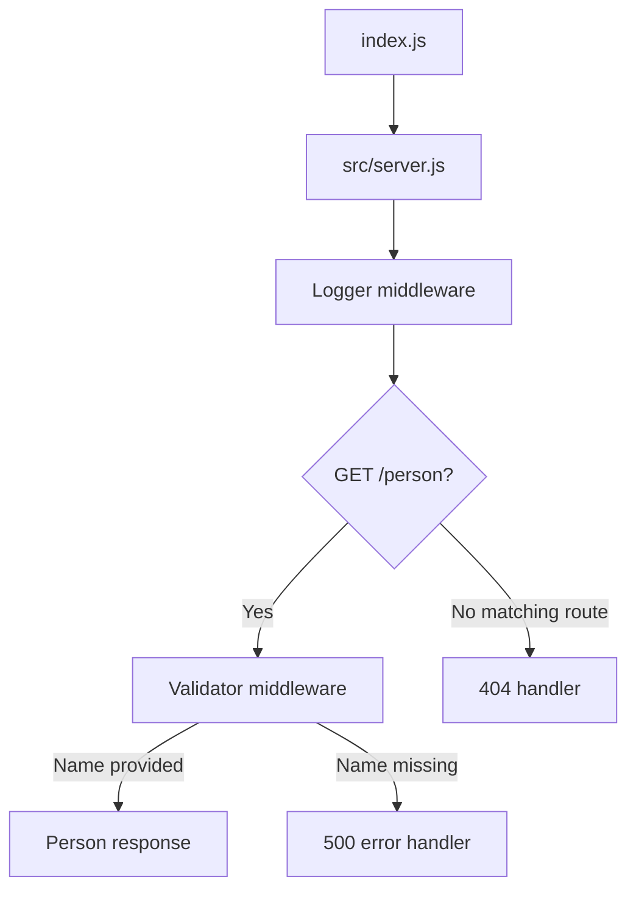

# basicExpressServer

basic server built with 'best practices'

## Links

- [Deployed application](https://basicexpressserver.onrender.com/)
- [GitHub Actions](https://github.com/tonch-LIV/basicExpressServer/actions)
- [Pull request](https://github.com/tonch-LIV/basicExpressServer/pull/1)

## API

### `GET /person`

Accepts a `name` query parameter:

```text
/person?name=fred
```

Successful response:

```json
{
  "name": "fred"
}
```

A request without a name returns a `500` response.

Unknown routes and unsupported HTTP methods return a `404` response.

## Application Structure



## Running the Application

Install dependencies:

```bash
npm install
```

Run the tests:

```bash
npm test
```

Start the development server:

```bash
npm run dev
```

## Changelog

- created repo w/ Node `.gitignore`, MIT license, and README.
- created `dev` branch, ran `npm init -y`, installed `express@4.19.2 dotenv@16.4.5`
  - `--save-dev jest@29.7.0 supertest@6.3.4 nodemon`.
- created sub-directories and empty files; which will be needed, as specified by assignment instructions (view changed files).
- configured `package.json` scripts for `start`, `dev`, `test`, and corrected license from `init` default.
- set up `index.js`; entry and starting point for `server.js`; also loads environment variables.
- defined middleware for logging and `name` validation.
- defined error handlers for unknown paths and unsupported methods.
- defined `server.js`; flow for requests should be,
  - logger,  
    - 404 handler, IF no route and method combo matches.
  - GET /person, 
  - validator,  
    - IF `name` is missing,  
    - next(Error),  
    - 500 handler.  
  - getPerson,
  - JSON response
- defined tests in `__tests__/server.test.js`.
- added github actions.
- verified all five tests locally and through GitHub Actions.
- opened and merged the pull request from `dev` into `main`.
- deployed the `main` branch to Render.
- verified the deployed `/person`, missing-name, and unknown-route responses.